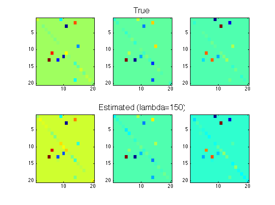

# DAL

Dual Augmented Lagrangian (DAL) algorithm for sparse/low-rank reconstruction and learning. For more details, check out our [JMLR paper](http://jmlr.csail.mit.edu/papers/v12/tomioka11a.html), [book chapter](http://ttic.uchicago.edu/~ryotat/opt_book.pdf), [talk](http://videolectures.net/nipsworkshops09_tomioka_slc/), and [slides](http://ttic.uchicago.edu/~ryotat/talks/opt09talk.pdf).


## Examples

### L1-regularized squared-loss regression (LASSO)

```matlab
 m = 1024; n = 4096; k = round(0.04*n); A=randn(m,n);
 w0=randsparse(n,k); bb=A*w0+0.01*randn(m,1);
 lambda=0.1*max(abs(A'*bb));
 [ww,stat]=dalsql1(zeros(n,1), A, bb, lambda);
```

### L1-regularized logistic regression

```matlab
 m = 1024; n = 4096; k = round(0.04*n); A=randn(m,n);
 w0=randsparse(n,k); yy=sign(A*w0+0.01*randn(m,1));
 lambda=0.1*max(abs(A'*yy));
 [ww,bias,stat]=dallrl1(zeros(n,1), 0, A, yy, lambda);
```

### Grouped-L1-regularized logistic regression

```matlab
 m = 1024; n = [64 64]; k = round(0.1*n(1)); A=randn(m,prod(n));
 w0=randsparse(n,k); yy=sign(A*w0(:)+0.01*randn(m,1));
 lambda=0.1*max(sqrt(sum(reshape(A'*yy/2,n).^2)));
 [ww,bias,stat]=dallrgl(zeros(n), 0, A, yy, lambda);
```

###  Trace-norm-regularized logistic regression

```matlab
 m = 2048; n = [64 64]; r = round(0.1*n(1)); A=randn(m,prod(n));
 w0=randsparse(n,'rank',r); yy=sign(A*w0(:)+0.01*randn(m,1));
 lambda=0.2*norm(reshape(A'*yy/2,n));
 [ww,bias,stat]=dallrds(zeros(n), 0, A, yy, lambda);
```

### Noisy matrix completion
```matlab
 n = [640 640]; r = 6; m = 2*r*sum(n);
 w0=randsparse(n,'rank',r);
 ind=randperm(prod(n)); ind=ind(1:m);
 A=sparse(1:m, ind, ones(1,m), m, prod(n));
 yy=A*w0(:)+0.01*randn(m,1);
 lambda=0.3*norm(reshape(A'*yy,n));
 [ww,stat]=dalsqds(zeros(n),A,yy,lambda,'solver','qn');
```

### LASSO with individual weights

```matlab
 m = 1024; n = 4096; k = round(0.04*n); A=randn(m,n);
 w0=randsparse(n,k); bb=A*w0+0.01*randn(m,1);
 pp=0.1*abs(A'*bb);
 [ww,stat]=dalsqal1(zeros(n,1), A, bb, pp);
```

### Individually weighted sqaured loss

```matlab
 m = 1024; n = 4096; k = round(0.04*n); A=randn(m,n);
 w0=randsparse(n,k); bb=A*w0+0.01*randn(m,1);
 lambda=0.1*max(abs(A'*bb));
 weight=(1:m)';
 [ww,stat]=dalsqwl1(zeros(n,1), A, bb, lambda, weight);
 figure, plot(bb-A*ww);
```

### Elastic-net-regularized squared-loss regression

```matlab
 m = 1024; n = 4096; k = round(0.04*n); A=randn(m,n);
 w0=randsparse(n,k); bb=A*w0+0.01*randn(m,1);
 lambda=0.1*max(abs(A'*bb));
 [ww,stat]=dalsqen(zeros(n,1), A, bb, lambda, 0.5);
```

### Sparsely-connected multivariate AR model
Try
```matlab
 exp_hsgl
```
To get



Here the model is a sparsely connected 3rd order multi-variate AR model with 20 variables. The top row shows the true coefficients. The bottom row shows the estimated coefficients.

See [exp_hsgl.m](./matlab/exp_hsgl.m) and our [paper](http://www.ncbi.nlm.nih.gov/pubmed/20483681) for more details.

## References

 * Ryota Tomioka, Taiji Suzuki, and Masashi Sugiyama (2011) [Augmented Lagrangian Methods for Learning, Selecting, and Combining Features.](http://ttic.uchicago.edu/~ryotat/opt_book.pdf) In Suvrit Sra, Sebastian Nowozin, and Stephen J. Wright, editors, Optimization for Machine Learning. MIT Press.
 * Ryota Tomioka, Taiji Suzuki, Masashi Sugiyama, and Hisashi Kashima (2010)[A Fast Augmented Lagrangian Algorithm for Learning Low-Rank Matrices.](http://ttic.uchicago.edu/~ryotat/papers/icml2010.pdf) In Proc. of the 27 th Annual International Conference on Machine Learning (ICML 2010), Haifa, Israel. [[Slides]](http://ttic.uchicago.edu/~ryotat/talks/icml10talk.pdf) [[Support page]](https://github.com/ryotat/ICML10)
 * Ryota Tomioka, Taiji Suzuki, and Masashi Sugiyama (2011) [Super-Linear Convergence of Dual Augmented Lagrangian Algorithm for Sparse Learning.](http://jmlr.org/papers/volume12/tomioka11a/tomioka11a.pdf) JMLR 12: 1537-1586. [[Support Page]](https://github.com/ryotat/Opt09)
 * Ryota Tomioka &amp; Masashi Sugiyama (2009) [Dual Augmented Lagrangian Method for Efficient Sparse Reconstruction](http://ieeexplore.ieee.org/search/wrapper.jsp?arnumber=5204163/) IEEE Signal Proccesing Letters, 16 (12) pp. 1067-1070.

## Papers that use DAL

 * Yamada, M., Jitkrittum, W., Sigal, L., Xing, E. P., & Sugiyama, M. (2014) [High-dimensional feature selection by feature-wise kernelized lasso.](http://sugiyama-www.cs.titech.ac.jp/~sugi/2014/HSICLasso.pdf) Neural Computatio 26(1):185-207.
 * Kriti Puniyani, Seyoung Kim and Eric P. Xing (2010) [Multi-population GWA mapping via multi-task regularized regression.](http://bioinformatics.oxfordjournals.org/content/26/12/i208) Bioinformatics, 26 (12): pp. i208-i216.
 *  S. Haufe, R. Tomioka, T. Dickhaus, C. Sannelli, B. Blankertz, G. Nolte, K.-R. Müller (2010) [Large-scale EEG/MEG source localization with spatial flexibility.](http://www.ncbi.nlm.nih.gov/pubmed/20832477) Neuroimage.
 *  Stefan Haufe, Ryota Tomioka, Guido Nolte, Klaus-Robert Müller, and Motoaki Kawanabe (2010) [Modeling sparse connectivity between underlying brain sources for EEG/MEG.](http://www.ncbi.nlm.nih.gov/pubmed/20483681) IEEE Trans. Biomed. Eng. 57(8), pp. 1954-1963.


## Acknowledgments

I would like to thank Stefan Haufe, Christian Kothe, Marius Kloft, Artemy Kolchinsky, and Makoto Yamada for testing the software and pointing out some problems. The non-negative lasso extension was contributed by Shigeyuki Oba. The weighted lasso was contributed by Satoshi Hara. I was supported by the Global COE program (Computationism as a Foundation for the Sciences) until March 2009.
